# E-vote - Blockchain Voting Platform

A decentralized voting application built on Ethereum that ensures transparent, secure, and tamper-proof elections through smart contract technology.

## Screenshots

### Landing Page
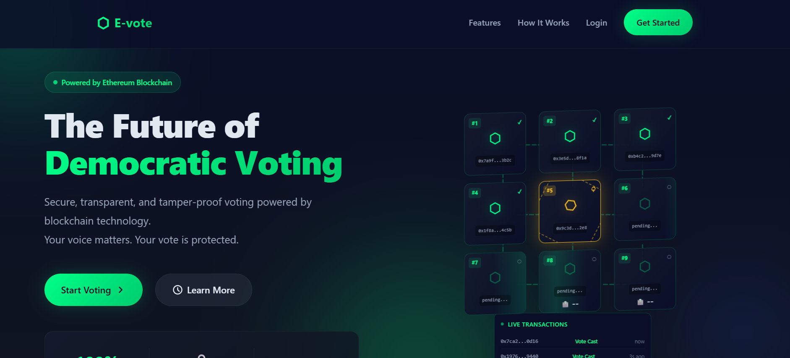
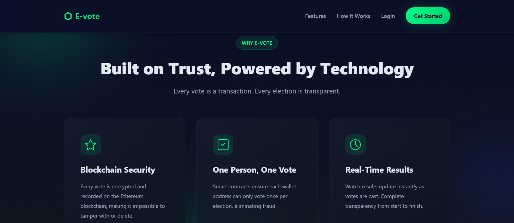


### User Registration
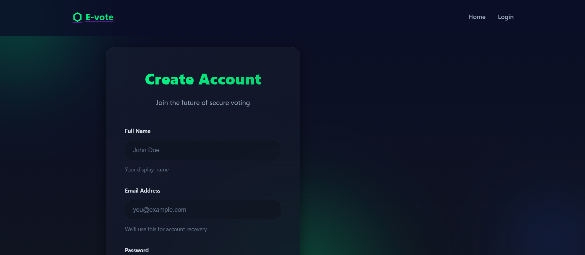
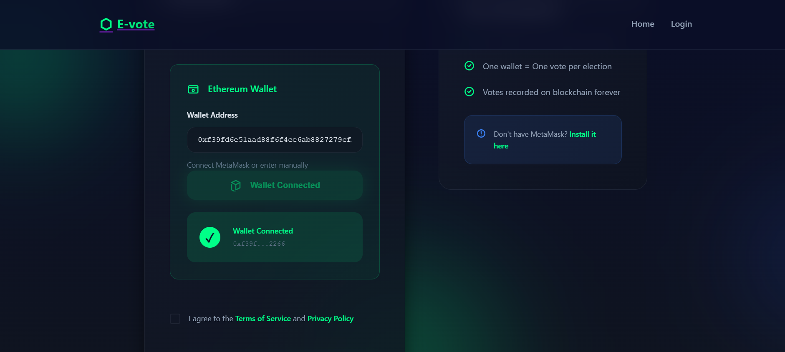
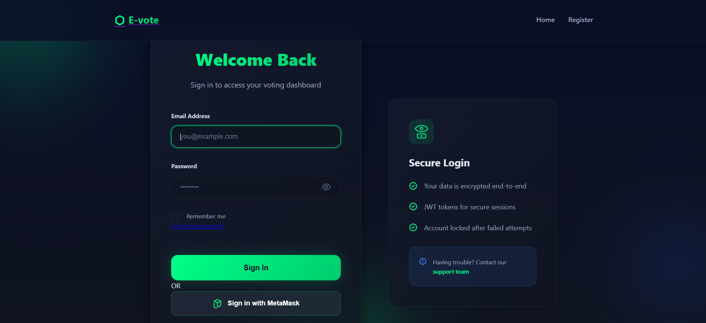

### User Dashboard
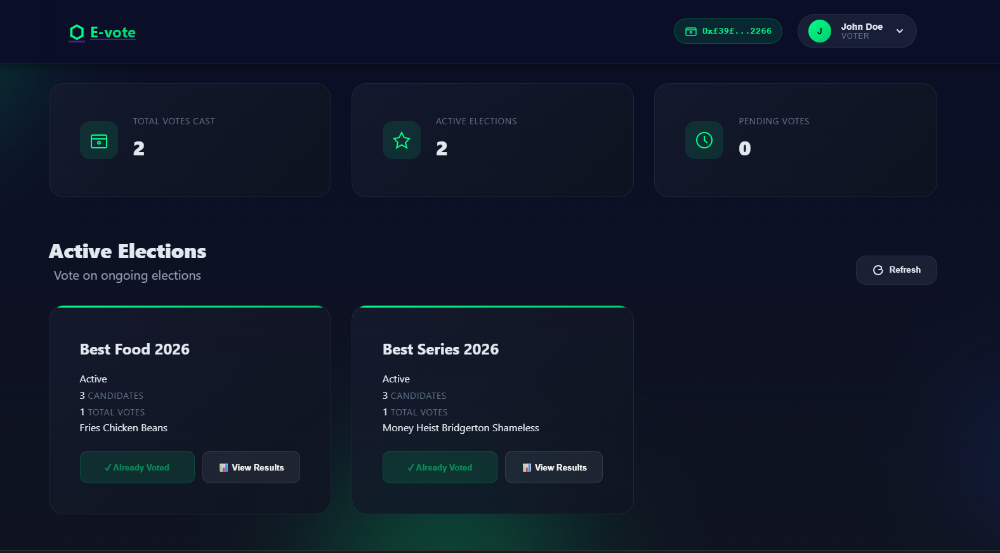
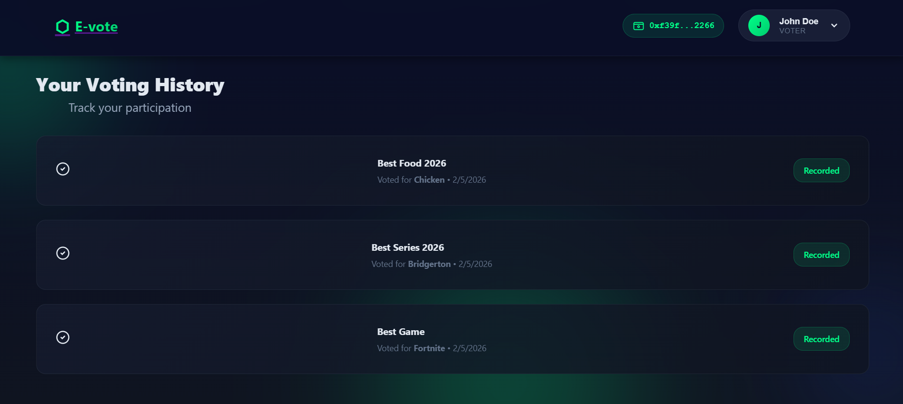

### Voting Interface
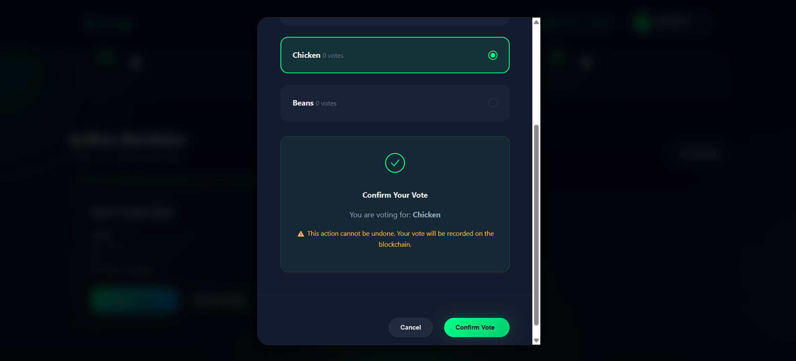

### Real-Time Results
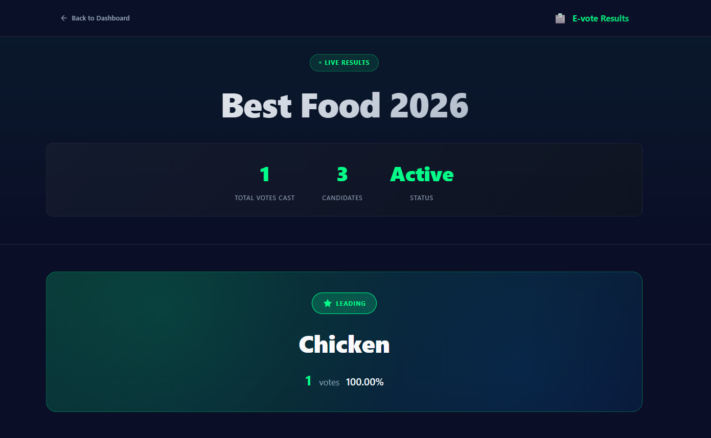
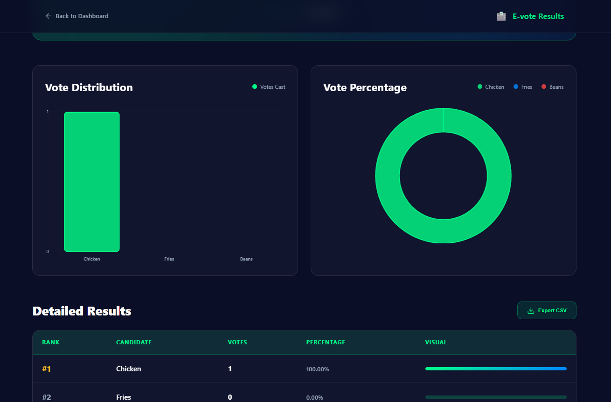
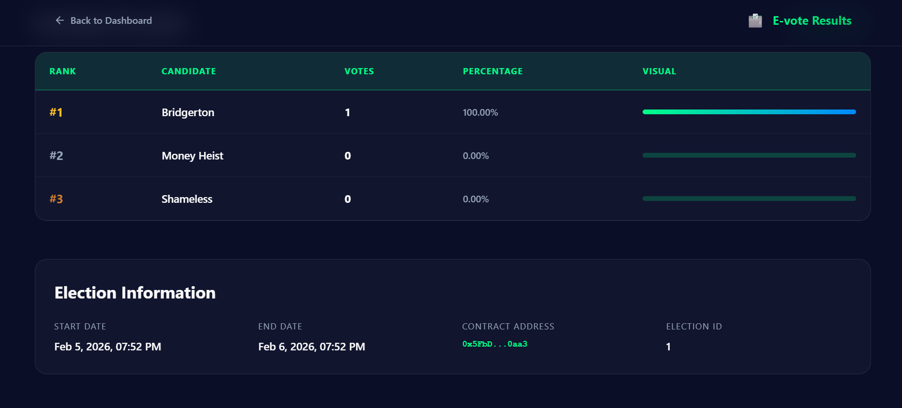

### Admin Panel
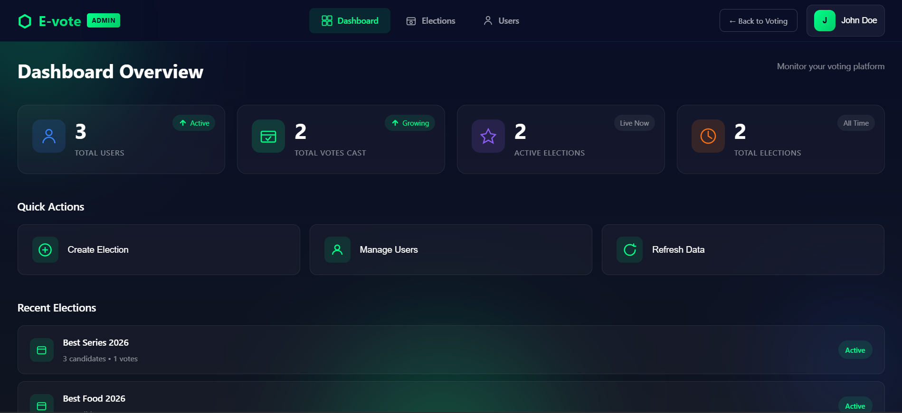
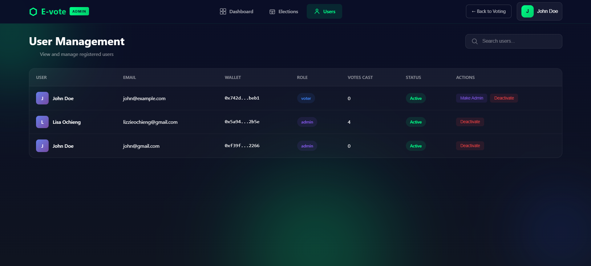
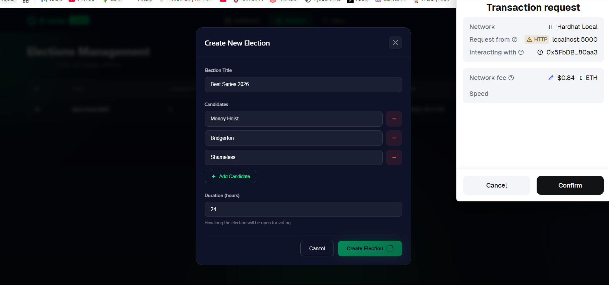
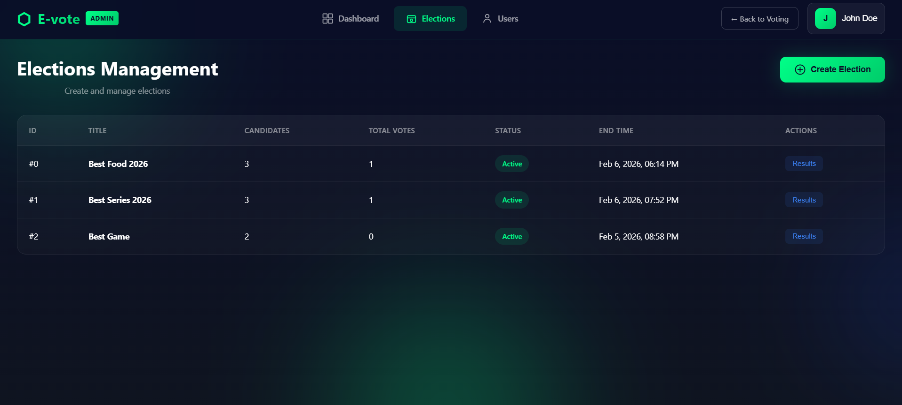

---

## Overview

E-vote is a full-stack blockchain voting platform I built to demonstrate how Ethereum smart contracts can solve traditional voting system problems. Every vote gets cryptographically secured and permanently recorded on the blockchain, which makes tampering basically impossible while keeping voter privacy intact through wallet-based authentication.

The idea was to create something that proves blockchain isn't just hype - it actually solves real problems. Traditional voting systems are vulnerable to manipulation, lack transparency, and require trust in centralized authorities. This application eliminates those issues by putting everything on an immutable public ledger.

## Key Features

- **Immutable Vote Recording** - All votes are permanently stored on the Ethereum blockchain
- **Double Voting Prevention** - Smart contracts automatically enforce one vote per wallet address per election
- **Real-Time Results** - Live vote tallying with Chart.js visualizations
- **Role-Based Access Control** - Separate interfaces for regular voters and election administrators
- **Comprehensive Audit Trail** - Complete voting history tracking
- **Responsive Design** - Works on desktop, tablet, and mobile
- **MetaMask Integration** - Secure wallet-based authentication

## Technology Stack

**Frontend:**
- HTML5, CSS3, JavaScript (ES6+)
- Chart.js for data visualization
- Ethers.js v6 for blockchain interaction
- Responsive CSS

**Backend:**
- Node.js with Express.js
- MongoDB for user management and vote history
- JWT authentication
- bcrypt for password hashing

**Blockchain:**
- Solidity smart contracts
- Hardhat development environment
- Ethers.js for Web3 integration
- Local Ethereum test network

---

## Prerequisites

Before you start, you'll need these installed on your machine:

### 1. Node.js
- **Version:** v20.x LTS recommended (minimum v14.x)
- **Download:** https://nodejs.org/
- **Check installation:**
  ```bash
  node --version
  ```

### 2. MongoDB
- **Option A:** Local installation from https://www.mongodb.com/try/download/community
- **Option B:** Cloud version (MongoDB Atlas) from https://www.mongodb.com/cloud/atlas
- **Check installation:**
  ```bash
  mongod --version
  ```

### 3. MetaMask Browser Extension
- **Download:** https://metamask.io/
- **Supported:** Chrome, Firefox, Brave, Edge
- This is how you'll interact with the blockchain

### 4. Git
- **Download:** https://git-scm.com/
- **Check installation:**
  ```bash
  git --version
  ```

### 5. Code Editor
- I recommend VS Code from https://code.visualstudio.com/
- Any text editor works though

---

## Installation & Setup

Follow these steps in order. If something breaks, check the Troubleshooting section at the bottom.

### Step 1: Clone the Repository

```bash
git clone https://github.com/yourusername/evote-blockchain.git
cd evote-blockchain
```

### Step 2: Install Dependencies

```bash
npm install --legacy-peer-deps
```

This takes a couple minutes. The `--legacy-peer-deps` flag is necessary because some Hardhat packages have version conflicts, but they work fine together.

### Step 3: Configure Environment Variables

Create a file named `.env` in the project root and add:

```env
PORT=5000
MONGODB_URI=mongodb://localhost:27017/voting-app
JWT_SECRET=your_super_secret_random_string_change_this
JWT_EXPIRE=30d
NODE_ENV=development
```

Important: Replace `your_super_secret_random_string_change_this` with an actual random string. You can generate one with:

```bash
node -e "console.log(require('crypto').randomBytes(32).toString('hex'))"
```

This file stores sensitive configuration that should never be committed to Git.

### Step 4: Start MongoDB

**On Windows:**
```bash
net start MongoDB
```

**On Mac:**
```bash
brew services start mongodb-community
```

**On Linux:**
```bash
sudo systemctl start mongod
```

If you're using MongoDB Atlas instead, skip this and make sure your connection string is in the `.env` file.

### Step 5: Start the Application

This requires three terminal windows running simultaneously. If you're using VS Code, press Ctrl + ` to open the terminal, then click + to create new ones.

#### Terminal 1: Start the Blockchain

```bash
npx hardhat node
```

You'll see something like:

```
Started HTTP and WebSocket JSON-RPC server at http://127.0.0.1:8545/

Accounts
========
Account #0: 0xf39Fd6e51aad88F6F4ce6aB8827279cffFb92266 (10000 ETH)
Private Key: 0xac0974bec39a17e36ba4a6b4d238ff944bacb478cbed5efcaeaa7b4e41de5d80
```

Leave this terminal running. This is your local Ethereum blockchain.

#### Terminal 2: Deploy Smart Contracts

Wait about 5 seconds for the blockchain to fully start, then in a new terminal:

```bash
npx hardhat run scripts/deploy.ts --network localhost
```

You'll see:

```
Deploying with account: 0xf39Fd6e51aad88F6F4ce6aB8827279cffFb92266

Deployed successfully!

Contract Address: 0x5FbDB2315678afecb367f032d93F642f64180aa3
```

Copy that contract address. You'll need it next.

#### Terminal 3: Start the Backend Server

In a third terminal:

```bash
npm start
```

You should see:

```
Server running on port 5000
Environment: development
Database: Connected
```

### Step 6: Update Contract Address

Open `public/js/contract-abi.js` and find this line (around line 228):

```javascript
const CONTRACT_ADDRESS = '0x5FbDB2315678afecb367f032d93F642f64180aa3';
```

Replace it with the contract address you copied from the deployment.

### Step 7: Configure MetaMask

This part is crucial for the app to work.

1. Open MetaMask in your browser
2. Click the network dropdown at the top
3. Select "Add Network" then "Add a network manually"
4. Enter these details:
   - **Network Name:** `Hardhat Local`
   - **RPC URL:** `http://127.0.0.1:8545`
   - **Chain ID:** `31337`
   - **Currency Symbol:** `ETH`
5. Save and switch to this network

**Import a Test Account:**

1. Go back to Terminal 1 where Hardhat is running
2. Copy the Private Key from Account #0
3. In MetaMask: Click account icon, then "Import Account"
4. Paste the private key
5. You'll now have 10,000 test ETH

### Step 8: Access the Application

Open your browser and go to:

```
http://localhost:5000
```

---

## How to Use

### For Regular Users (Voters)

#### Registration

1. Click "Get Started" or "Create Account"
2. Fill in your name, email, and password (minimum 8 characters)
3. Click "Connect MetaMask"
   - MetaMask will pop up
   - Click "Next" then "Connect"
   - Your wallet address will auto-fill
4. Check the "I agree to Terms" box
5. Click "Create Account"

If the button stays greyed out, make sure all fields are filled and MetaMask shows a green checkmark.

#### Login

1. Enter your email and password
2. Click "Sign In"

You'll be redirected to your dashboard.

#### Voting

1. On your dashboard, find an active election
2. Click "Vote Now"
3. Select your candidate (they'll highlight when clicked)
4. Click "Confirm Vote"
5. MetaMask will pop up - click "Confirm"
6. Wait for the blockchain transaction to complete

You can only vote once per election. After voting, the button will show "Already Voted".

#### Viewing Results

1. Click "View Results" on any election
2. You'll see real-time vote counts and charts

The data comes directly from the smart contract, so it's always current.

#### Voting History

Scroll down on your dashboard to see:
- All elections you've participated in
- Which candidate you voted for
- When you voted
- Total votes cast

---

### For Administrators

#### Becoming an Admin

First, register as a normal user. Then:

1. Open a terminal in your project folder
2. Run:
   ```bash
   node make-admin.cjs
   ```
3. Enter your email when prompted

You'll see a confirmation that your account was updated.

#### Accessing Admin Panel

1. Logout and login again (to refresh your role)
2. Navigate directly to:
   ```
   http://localhost:5000/admin.html
   ```

#### Creating Elections

1. In the admin panel, find "Create New Election"
2. Fill in:
   - **Election Title:** e.g., "Student Council President 2025"
   - **Candidates:** Comma-separated names like "Alice Johnson, Bob Smith, Charlie Davis"
   - **Duration:** Hours the election should run (e.g., 24 for one day)
3. Click "Create Election"
4. Confirm the transaction in MetaMask
5. Wait for blockchain confirmation

The election will immediately appear for all users and voting will be open for the specified duration.

#### Managing Users

The admin panel lets you:
- View all registered users
- Activate or deactivate accounts
- Promote other users to admin
- View platform statistics

---

## Project Structure

```
evote-blockchain/
├── contracts/              # Solidity smart contracts
│   └── Voting.sol         # Main voting contract
│
├── scripts/               # Deployment scripts
│   └── deploy.ts          # Contract deployment
│
├── models/                # Database schemas
│   └── User.cjs          # User model
│
├── public/                # Frontend files
│   ├── css/              # Stylesheets
│   ├── js/               # Client-side JavaScript
│   ├── index.html        # Landing page
│   ├── dashboard.html    # User dashboard
│   ├── admin.html        # Admin panel
│   ├── results.html      # Results page
│   ├── login.html        # Login
│   └── register.html     # Registration
│
├── screenshots/           # Application screenshots
├── server.cjs            # Express backend
├── make-admin.cjs        # Admin utility
├── hardhat.config.cjs    # Hardhat configuration
├── .env                  # Environment variables
├── .gitignore           # Git ignore rules
├── package.json         # Dependencies
└── README.md           # This file
```

---

## How It Works

### The Voting Process

1. **Registration:** User creates an account and links their MetaMask wallet. Credentials are stored in MongoDB with JWT authentication.

2. **Election Creation:** Admin calls `createElection()` on the smart contract. The election data gets stored on the blockchain with candidates, start time, and end time.

3. **Voting:** User selects a candidate and confirms in MetaMask. The `vote()` function on the smart contract records the vote permanently. The backend also logs it in MongoDB for user history.

4. **Results:** Frontend calls `getResults()` from the smart contract, which returns vote counts. Chart.js renders the visualizations.

### Smart Contract Functions

The Voting.sol contract has these main functions:

```solidity
// Create a new election (admin only)
createElection(string _title, string[] _candidateNames, uint256 _durationInHours)

// Cast a vote
vote(uint256 _electionId, uint256 _candidateId)

// Get election results
getResults(uint256 _electionId) returns (Candidate[])

// Check if address has voted
hasVoted(uint256 _electionId, address _voter) returns (bool)
```

All votes are recorded on-chain, which makes them immutable and publicly verifiable.

---

## Troubleshooting

### "Cannot find module" errors

```bash
rm -rf node_modules package-lock.json
npm install --legacy-peer-deps
```

### MongoDB won't connect

Check if MongoDB is running:

**Windows:**
```bash
net start MongoDB
```

**Mac/Linux:**
```bash
sudo systemctl status mongod
```

Also verify your `MONGODB_URI` in the `.env` file is correct.

### MetaMask shows "Wrong network"

Make sure you're connected to the "Hardhat Local" network with Chain ID 31337. If you don't see it in your network list, go back to Step 7 and add it.

### "Contract not found" or "Call reverted" errors

This happens when you restart the Hardhat node, which resets the blockchain.

Solution:
1. Redeploy the contract:
   ```bash
   npx hardhat run scripts/deploy.ts --network localhost
   ```
2. Copy the new contract address
3. Update `public/js/contract-abi.js`
4. Hard refresh your browser (Ctrl + Shift + R)

### Votes showing "Unknown" in history

This happens after restarting Hardhat because the old elections no longer exist on the reset blockchain. Future votes will work correctly.

### Registration button stays disabled

Make sure:
- All fields are filled
- Password is at least 8 characters
- Passwords match
- MetaMask is connected
- Terms checkbox is checked

If still stuck, try clearing your browser cache and doing a hard refresh (Ctrl + Shift + R).

### Transaction failures

- Ensure you have enough ETH in MetaMask (test accounts start with 10,000)
- Verify you're on the correct network
- Check that the election is currently active
- Make sure you haven't already voted in this election

---

## Security Considerations

This is a development version built for learning. Before using in production:

**Required:**
- Smart contract security audit
- Penetration testing
- SSL/TLS implementation
- Rate limiting
- DDoS protection
- Regular security updates

**Already implemented:**
- Password hashing with bcrypt
- JWT authentication
- Protected admin routes
- Smart contract access controls
- One vote per wallet enforcement
- Input validation

**Never do:**
- Commit your `.env` file
- Share your JWT_SECRET
- Use test private keys in production
- Deploy without security review

---

## API Documentation

### Authentication Endpoints

**POST** `/api/auth/register`
- Register new user
- Body: `{ name, email, password, walletAddress }`

**POST** `/api/auth/login`
- User login
- Body: `{ email, password }`

**GET** `/api/auth/me`
- Get current user profile
- Requires: JWT token

**PUT** `/api/auth/profile`
- Update user profile
- Requires: JWT token

**PUT** `/api/auth/change-password`
- Change password
- Requires: JWT token

**PUT** `/api/auth/connect-wallet`
- Link wallet address
- Requires: JWT token

### Voting Endpoints

**POST** `/api/votes/record`
- Record vote in database (called after blockchain transaction)
- Body: `{ electionId, candidateId }`
- Requires: JWT token

**GET** `/api/votes/history`
- Get user's voting history
- Requires: JWT token

### Admin Endpoints

**GET** `/api/admin/users`
- List all users
- Requires: Admin JWT token

**GET** `/api/admin/stats`
- Platform statistics
- Requires: Admin JWT token

**PUT** `/api/admin/users/:id/activate`
- Activate user account
- Requires: Admin JWT token

**PUT** `/api/admin/users/:id/deactivate`
- Deactivate user account
- Requires: Admin JWT token

**PUT** `/api/admin/users/:id/make-admin`
- Grant admin privileges
- Requires: Admin JWT token

---

## Contributing

If you want to contribute:

1. Fork the repository
2. Create a feature branch: `git checkout -b feature/NewFeature`
3. Commit your changes: `git commit -m 'Add NewFeature'`
4. Push to the branch: `git push origin feature/NewFeature`
5. Open a Pull Request

Please:
- Follow the existing code style
- Add comments for complex logic
- Test thoroughly before submitting
- Update documentation if needed

---

## Future Improvements

Things I'd like to add:

- Email verification
- WebSocket for real-time updates
- Multi-language support
- Mobile apps
- Deploy to other networks (Polygon, Arbitrum)
- Advanced analytics
- Identity verification
- Ranked choice voting
- Export results to PDF
- Two-factor authentication

---

## License

MIT License - see LICENSE file for details.

You're free to use, modify, and distribute this project. No warranty provided.

---

## Acknowledgments

Built using:
- Ethereum and Solidity
- Hardhat development framework
- Ethers.js
- Express.js
- MongoDB
- Chart.js
- MetaMask

Thanks to the Web3 community for documentation and resources.

---

## Contact

For issues, questions, or bugs, open an issue on GitHub.

---

## Disclaimer

This application is for educational and development purposes only. It is NOT production-ready without proper security audits and testing. Do not use for real elections without extensive review. The developers assume no liability for any issues arising from use of this software.

Test on testnets before any mainnet deployment. Always get professional security audits for production smart contracts.

---

*Built to demonstrate blockchain's potential for transparent and secure voting systems.*